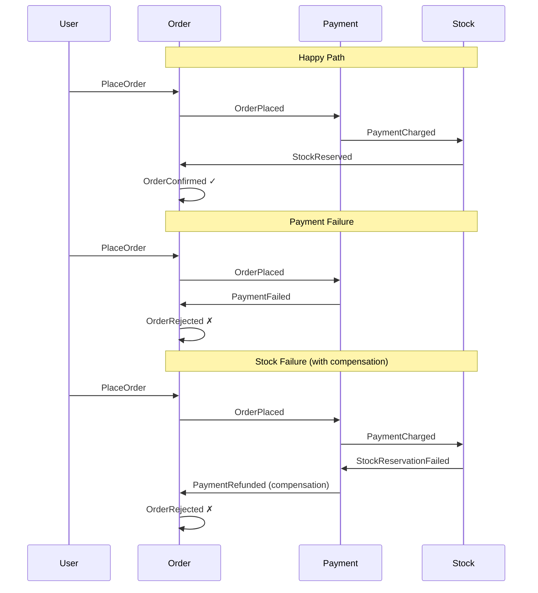

# Choreography Saga Pattern Example

## Overview

Add a workshop-style example of the **Saga pattern using choreography** to demonstrate how multiple bounded contexts coordinate a multi-step business process purely through domain events, with no central orchestrator. Uses a classic e-commerce scenario (Order, Payment, Stock) with full compensation logic on failure paths.

## Problem Statement / Motivation

The repository serves as a workshop for visualising architectural patterns in DDD/CQRS. The saga pattern — specifically the choreography variant — is a fundamental pattern for distributed transactions that is difficult to grasp from diagrams alone. Seeing the event chain, handler reactions, and compensation logic in concrete PHP code makes the pattern tangible.

## Proposed Solution

Three new bounded contexts under `src/Saga/` — **Order**, **Payment**, **Stock** — each owning its own events, handlers, and domain model. No shared state, no orchestrator. Each service reacts to events from other services and publishes its own.

### Event Flow Summary

```
HAPPY PATH:
  PlaceOrder → OrderPlaced → ChargePayment → PaymentCharged
  → ReserveStock → StockReserved → ConfirmOrder → OrderConfirmed

PAYMENT FAILURE:
  PlaceOrder → OrderPlaced → ChargePayment fails → PaymentFailed
  → RejectOrder → OrderRejected

STOCK FAILURE (with compensation):
  ...PaymentCharged → ReserveStock fails → StockReservationFailed
  → RefundPayment → PaymentRefunded → RejectOrder → OrderRejected
```

### Event–Handler Matrix

| Event                    | Published by | Listened by | Triggers handler         |
|--------------------------|-------------|-------------|--------------------------|
| `OrderPlaced`            | Order       | Payment     | `ChargePaymentHandler`   |
| `PaymentCharged`         | Payment     | Stock       | `ReserveStockHandler`    |
| `PaymentFailed`          | Payment     | Order       | `RejectOrderOnPaymentFailureHandler` |
| `StockReserved`          | Stock       | Order       | `ConfirmOrderHandler`    |
| `StockReservationFailed` | Stock       | Payment     | `RefundPaymentHandler`   |
| `PaymentRefunded`        | Payment     | Order       | `RejectOrderOnRefundHandler` |
| `OrderConfirmed`         | Order       | —           | Terminal                 |
| `OrderRejected`          | Order       | —           | Terminal                 |

## Technical Considerations

### Design Decisions

1. **Fat events** — each event carries enough data for the receiving handler to act without cross-context queries. This keeps bounded contexts truly independent. See "Event Signatures" below for exact constructor parameters.

2. **`orderId` as correlation ID** — every event in the saga carries `orderId: Id` so handlers can correlate events to the same business process.

3. **Two separate rejection handlers** — rather than one `RejectOrderHandler` listening to two different event types, use two clearly named handlers (`RejectOrderOnPaymentFailureHandler`, `RejectOrderOnRefundHandler`). This is more explicit about *why* the order is being rejected and avoids a polymorphic dispatch that obscures the choreography. Contrast this with the existing `TemplateEventListener` which uses a `match` expression for polymorphic dispatch — both patterns now exist in the repo for comparison.

4. **Refund failure is out of scope** — the spec explicitly does not model `PaymentRefundFailed`. A comment in `RefundPaymentHandler` acknowledges this is where choreography sagas hit their fundamental limitation and production systems would use a dead-letter queue or manual intervention.

5. **PHP 8.4 property hooks** — a `SagaEvent` interface with `public Id $orderId { get; }` demonstrates the feature and enforces that all saga events carry a correlation ID.

6. **Commands as readonly classes** — matching the event pattern, not interfaces. Keeps the workshop consistent.

7. **No Infrastructure layer** — this is pseudo-code for visualisation. Handlers reference repository interfaces but no implementations. The focus is on event flow, not persistence.

8. **Event naming convention** — the saga uses canonical DDD naming (`OrderPlaced`, `PaymentCharged`) rather than the existing codebase's `OfferForAdvertWasPrepared` style. The shorter form is more widely recognised and easier to scan across the event-handler matrix. This is a deliberate divergence for workshop clarity.

### Event Signatures

Every event implements `SagaEvent` (carries `orderId`). Additional fields ensure each handler can act autonomously:

```php
// Order context
PlaceOrder(Id $orderId, int $amount, string $currency, Id $productId)
OrderPlaced(Id $orderId, int $amount, string $currency, Id $productId)
OrderConfirmed(Id $orderId)
OrderRejected(Id $orderId, string $reason)

// Payment context
PaymentCharged(Id $orderId, Id $paymentId)
PaymentFailed(Id $orderId, string $reason)
PaymentRefunded(Id $orderId, Id $paymentId)

// Stock context — StockReservationFailed MUST carry paymentId so RefundPaymentHandler can issue the refund
StockReserved(Id $orderId, Id $reservationId)
StockReservationFailed(Id $orderId, Id $paymentId)
```

Key: `StockReservationFailed` carries `$paymentId` because `RefundPaymentHandler` needs it to issue the refund without querying the Payment context. This is the "fat events enable autonomy" principle at its most critical — if this field were missing, the compensation chain would break.

### Conventions (from existing codebase)

- `readonly class` for all events and commands
- Constructor property promotion
- `#[AsMessageHandler]` on handlers, `#[AsMessage]` on events (used as pseudo-attributes for visualisation — no full Symfony Messenger imports required)
- `__invoke(EventType $event): void` handler pattern
- `$this->bus->dispatch()` for publishing events
- `Freyr\Identity\Id` for all identifiers
- `declare(strict_types=1)` in all files
- Separate `use` imports (no grouped `{}` imports)
- PSR-12, PHPStan max level

## Acceptance Criteria

- [ ] Three bounded contexts exist under `src/Saga/` (Order, Payment, Stock)
- [ ] All 8 events are defined as readonly classes with `#[AsMessage]`
- [ ] All 7 handlers use `__invoke` pattern with `#[AsMessageHandler]`
- [ ] Happy path flow is traceable through handler → event → handler chain
- [ ] Payment failure path terminates correctly (no dangling state)
- [ ] Stock failure path includes compensation (refund) before rejection
- [ ] All events implement `SagaEvent` interface with `$orderId` property hook
- [ ] Integration tests trace all three flows (happy path, payment failure, stock failure)
- [ ] Code passes `phpstan --memory-limit=-1` at max level
- [ ] Code passes `ecs check`

## File Structure

```
src/Saga/
├── SagaEvent.php                                    # Interface with property hook
│
├── Order/
│   ├── DomainModel/
│   │   └── PlaceOrder.php                           # Command (readonly)
│   └── Application/
│       ├── PlaceOrderHandler.php                    # __invoke(PlaceOrder) → OrderPlaced
│       ├── ConfirmOrderHandler.php                  # __invoke(StockReserved) → OrderConfirmed
│       ├── RejectOrderOnPaymentFailureHandler.php   # __invoke(PaymentFailed) → OrderRejected
│       ├── RejectOrderOnRefundHandler.php           # __invoke(PaymentRefunded) → OrderRejected
│       ├── OrderPlaced.php                          # Event
│       ├── OrderConfirmed.php                       # Event
│       └── OrderRejected.php                        # Event
│
├── Payment/
│   └── Application/
│       ├── ChargePaymentHandler.php                 # __invoke(OrderPlaced) → PaymentCharged | PaymentFailed
│       ├── RefundPaymentHandler.php                 # __invoke(StockReservationFailed) → PaymentRefunded
│       ├── PaymentCharged.php                       # Event
│       ├── PaymentFailed.php                        # Event
│       └── PaymentRefunded.php                      # Event
│
└── Stock/
    └── Application/
        ├── ReserveStockHandler.php                  # __invoke(PaymentCharged) → StockReserved | StockReservationFailed
        ├── StockReserved.php                        # Event
        └── StockReservationFailed.php               # Event

tests/Saga/
└── ChoreographySagaTest.php                         # Integration tests for all 3 flows
```

**Total: 1 interface + 1 command + 8 events + 7 handlers + 1 test = 18 files**

Payment and Stock have no `DomainModel/` directory — they are purely reactive contexts with no externally-triggered commands. This is itself a teaching point about how lean a bounded context can be.

## Implementation Phases

### Phase 1: Write all files (17 source + 1 test)

Create all files in one pass. Suggested order follows the event chain for mental traceability:

1. `src/Saga/SagaEvent.php` — shared interface with property hook
2. **Order context** — entry point and terminal events:
   - `src/Saga/Order/DomainModel/PlaceOrder.php` (command)
   - `src/Saga/Order/Application/OrderPlaced.php` (event)
   - `src/Saga/Order/Application/OrderConfirmed.php` (event)
   - `src/Saga/Order/Application/OrderRejected.php` (event)
   - `src/Saga/Order/Application/PlaceOrderHandler.php` (handler)
   - `src/Saga/Order/Application/ConfirmOrderHandler.php` (handler)
   - `src/Saga/Order/Application/RejectOrderOnPaymentFailureHandler.php` (handler)
   - `src/Saga/Order/Application/RejectOrderOnRefundHandler.php` (handler)
3. **Payment context** — middle of the chain:
   - `src/Saga/Payment/Application/PaymentCharged.php` (event)
   - `src/Saga/Payment/Application/PaymentFailed.php` (event)
   - `src/Saga/Payment/Application/PaymentRefunded.php` (event)
   - `src/Saga/Payment/Application/ChargePaymentHandler.php` (handler)
   - `src/Saga/Payment/Application/RefundPaymentHandler.php` (handler)
4. **Stock context** — end of forward chain:
   - `src/Saga/Stock/Application/StockReserved.php` (event)
   - `src/Saga/Stock/Application/StockReservationFailed.php` (event)
   - `src/Saga/Stock/Application/ReserveStockHandler.php` (handler)
5. **Tests** — trace the full event chains:
   - `tests/Saga/ChoreographySagaTest.php` — 3 test methods:
     - `testHappyPathOrderConfirmed` — PlaceOrder → ... → OrderConfirmed
     - `testPaymentFailureRejectsOrder` — PlaceOrder → ... → OrderRejected (no compensation needed)
     - `testStockFailureRefundsAndRejectsOrder` — PlaceOrder → ... → PaymentRefunded → OrderRejected

Tests wire up all handlers with an in-memory message bus and assert the terminal event for each flow. These are the single most valuable teaching artefact — they make the invisible process visible in one file.

### Phase 2: Verify

- Run `phpstan --memory-limit=-1`
- Run `ecs check --fix`

## Mermaid Sequence Diagram



## Key Workshop Teaching Points

1. **The invisible process** — no single file shows the complete saga. You must trace through handlers across three contexts. This is the fundamental trade-off of choreography.
2. **Compensation is not rollback** — `PaymentRefunded` is a new forward action, not an undo. The system moves forward through compensating actions.
3. **Compensation of compensation** — what happens if the refund fails? Choreography has no answer. This is where orchestration or manual intervention becomes necessary.
4. **Fat events enable autonomy** — each handler has enough data to act without querying other contexts.
5. **Event naming matters** — past tense for events (facts), imperative for commands (intentions).
6. **Idempotency** — in production, events can be delivered more than once. A brief comment in `ConfirmOrderHandler` notes that handlers must be idempotent (check whether the operation has already been performed before executing).

## References

- Brainstorm: `docs/brainstorms/2026-02-16-choreography-saga-brainstorm.md`
- Existing event pattern: `src/Generator/Application/OfferForAdvertWasPrepared.php`
- Existing handler pattern: `src/Dispatcher/Application/SendOfferToOwnerHandler.php`
- Property hooks pattern: `src/Dispatcher/Application/Template/TemplateChangeMessage.php`
- Multi-event handler: `src/Dispatcher/Application/Template/TemplateEventListener.php`
